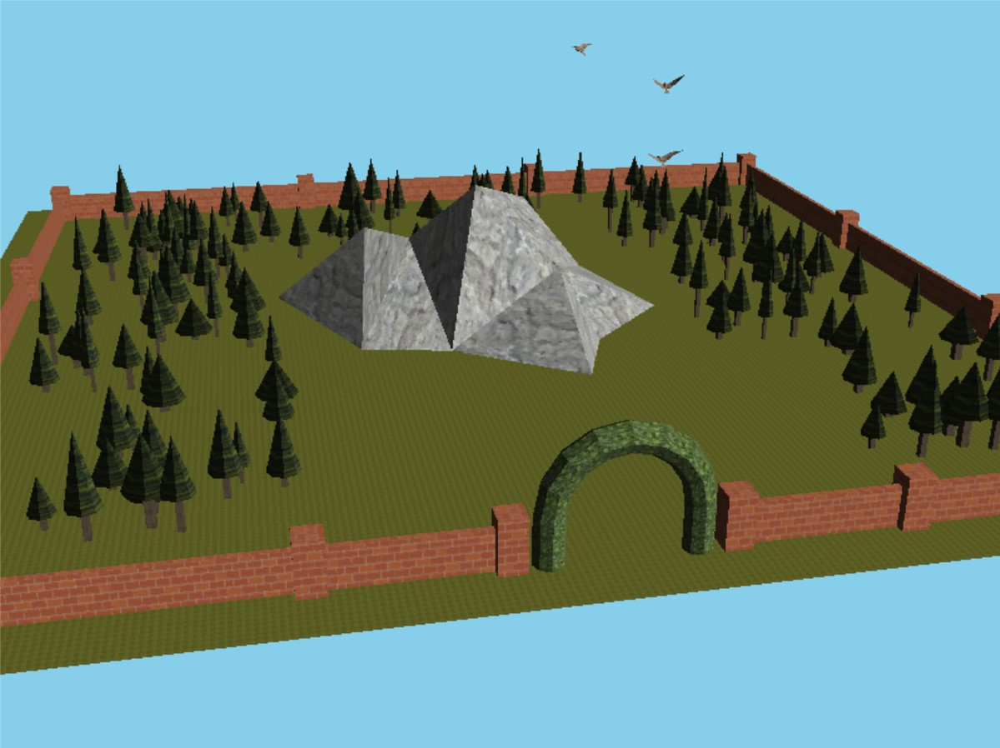
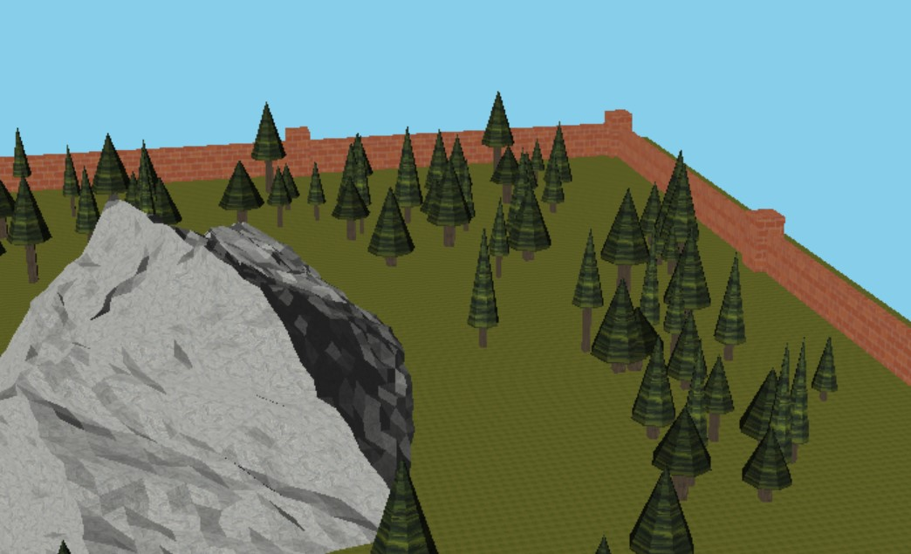
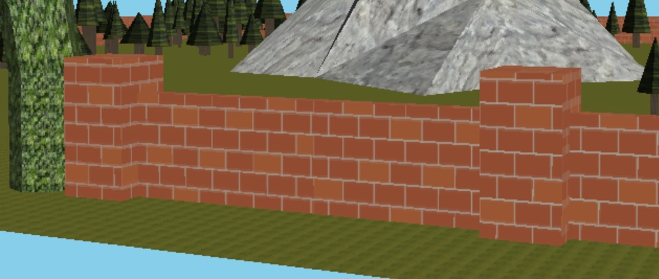

# CS547 Final Project — Forest Scene (OpenGL / C++)

## About

This repository contains the CS547 - Computer Graphics final project: a 3D rendered "Forest" park scene implemented in C++ and OpenGL. The scene includes a procedurally subdividable mountain, a randomized forest made of parameterized tree instances, a brick wall built from block instances, and three animated birds that fly along spline paths. The project demonstrates a number of course techniques including texture mapping, swept objects, parametric instancing, subdivision, hierarchical animated models, and simple scene lighting/time-of-day changes.

Final project report can be found in [docs/Final_Project_Report_Tayte_Waterman.pdf](docs/Final_Project_Report_Tayte_Waterman.pdf)

## Highlighted Content

### Forest Park Scene (Overview)

A compact "Forest" park scene combines a central mountain, an enclosing brick wall, and a procedurally generated forest. The scene demonstrates scene composition, instancing, and simple user-driven interaction (camera and lighting controls).

### Mountain Subdivision

The mountain is built from a small base mesh and refined by iterative midpoint subdivision. Each subdivision inserts midpoints with a controlled random displacement to create a rocky, natural silhouette demonstrating subdivision and procedural mesh detail.

### Parametric Trees

Trees are parametric models (swept cone foliage + prism trunk) with per-instance attribute variation. The forest uses display lists and parametric instancing to render many unique-looking trees efficiently.

### Animated Birds

Three animated birds follow spline tracks around the mountain. Each bird is a hierarchical animated model (wing segments, tail) driven by the `Track`/`Bird` classes to produce natural flapping and orientation along the path.

### Time-of-Day Selection

The scene supports multiple time-of-day presets that adjust light direction, color, and background to simulate morning, day, afternoon, and night. Lighting parameters are stored in arrays and cycled at user input to show basic dynamic scene lighting.

### View Perspective

The project provides several camera modes: the default orbit/pan controls, a birds-eye view anchored to the lead bird, and a low view looking up the mountain. This showcases alternate navigation systems and camera control techniques.

### Wall Textures

The project composes the enclosing park wall from individual `Block` instances — each block is a simple cube with an applied brick texture (`brick.tga`). This demonstrates basic texture mapping on primitives and using repeated instances to build larger structures efficiently.

## Usage

Build and run the Visual Studio solution found in the `project/` directory. The project includes a Visual Studio solution and project files (`Project.sln`, `Project.vcxproj`). Recommended on Windows:

1. Open `project/Project.sln` with Visual Studio (2019 or 2022).
2. Ensure the build configuration (x86/x64) matches your environment.
3. Build the solution and run the resulting executable from the IDE or the `Debug`/`Release` output folder.

Notes:

- The repository includes the FLTK library used by the original project skeleton under `fltk_2022_1.3.8/`. This is a third-party GUI library required by the project; it is not the author's code but is included here to simplify building.
- Textures and other assets used by the scene are located in `project/` (for example `brick.tga`, `rock.tga`, `grass.tga`, etc.).

**Controls** (keyboard / mouse):

`Left Mouse` - Hold and drag (default view) to rotate the camera
`Right Mouse` - Hold and drag (default view) to pan the camera
`Tab Key` - Cycle view. Default, birds-eye, low view
`Up Key` - Increase mountain subdivision (more detail)
`Down Key` - Decrease mountain subdivision (less detail)
`Right Key` - Advance time of day (morning → day → afternoon → night)
`Left Key` - Reverse time of day

## Project structure (key files)

- `project/` — C++ source and assets for the scene
  - `WorldWindow.cpp/.h` — main window and input handling
  - `World.cpp` — scene composition and draw loop
  - `Mountain.*` — mountain mesh + subdivision
  - `Forest.*`, `Tree.*` — parametric tree generation and instancing
  - `Track.*`, `Bird.*` — spline track and animated bird (hierarchical model)
  - `Wall.*`, `Block.*`, `Arch.*` — supporting scene geometry
  - texture files: `brick.tga`, `rock.tga`, `grass.tga`, `jasmine.tga`, `pine.tga`, `feathers.tga`, `bark.tga`
- `fltk_2022_1.3.8/` — included FLTK library files (headers, GL, and supporting headers). FLTK (Fast Light Toolkit) is a lightweight, cross-platform C++ GUI toolkit that provides widgets, windowing, and simple OpenGL integration; it's commonly used for small graphical apps and demos. This is a third-party library required to build/run the project.
- `docs/Final_Project_Report_Tayte_Waterman.pdf` — Final project report

## History

Last updated: November 2023

## License and attribution

FLTK library included under `fltk_2022_1.3.8/` is a third-party library; consult FLTK documentation and license for reuse terms [www.fltk.org](https://www.fltk.org/).
